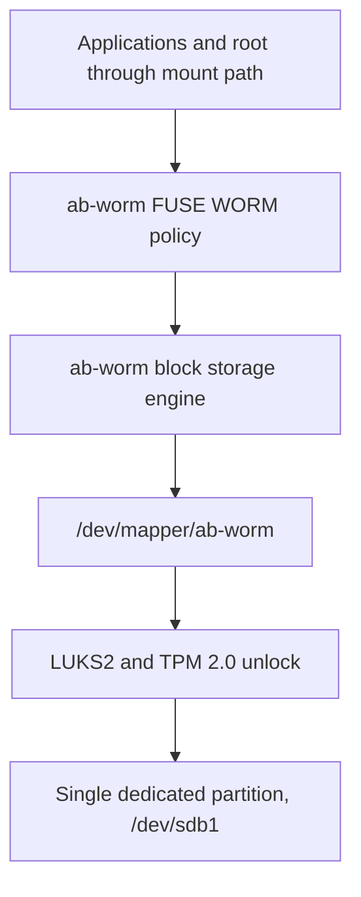

# Autobricks WORM Disk Design

**Status:** Design summary, 27 September 2026 

## 1. Objective

Use one dedicated disk partition as an encrypted, exclusive Autobricks WORM volume. Applications access files only through the `ab-worm` FUSE mount. The existing WORM policy permits appends at the committed boundary, rejects overwrites and renames, and prevents deletion until each file's fixed retention deadline. The policy also applies to root when root uses the FUSE mount path.

The disk is not first formatted with ext4 or mounted as a conventional backing filesystem. An `ab-worm` disk format will occupy the decrypted partition directly.

## 2. Storage stack



`/dev/sdb` is an example disk name, not a persistent identifier. Provision one GPT partition and refer to it by a stable `/dev/disk/by-id/...-part1` path or partition UUID. The partition contains LUKS2; its decrypted mapping contains an Autobricks volume header and the WORM data format. Ordinary filesystem mounting cannot interpret this custom format.

FUSE remains the file interface. It is independent of the block storage format beneath it. There is no need to implement a Linux kernel filesystem merely to use a raw block partition.

## 3. Provisioning and mounting

The intended interfaces are illustrative; they are **not implemented CLI commands**:

```text
ab-worm disk format <partition>       # destructive, explicit provisioning
ab-worm disk mount <partition> <mountpoint> --retain <days>
ab-worm disk unmount <mountpoint>
```

Provisioning creates the LUKS2 container and enrolls a TPM 2.0 unlock method, then creates the Autobricks disk format inside the unlocked mapping. The disk format needs its own signature, version, volume UUID, allocation information, file metadata, committed offsets, and recovery records. A documented recovery unlock method and protected LUKS header backup should be decided before production use; TPM or PCR changes can otherwise make data unavailable.

Mounting follows this sequence:

1. Identify and validate the intended single partition; refuse an unexpected device or an already active volume.
2. Unlock LUKS2 using the configured TPM 2.0 policy. Do not arrange an unrelated boot-time unlock that leaves the mapping open independently of the WORM service.
3. Open the decrypted block mapping exclusively (`O_EXCL`) and retain its file descriptor for the mounted volume's lifetime. Treat `EBUSY` as a refusal to mount.
4. Validate the Autobricks disk header and recover interrupted transactions before accepting writes.
5. Start the FUSE mount and expose files only through that mount.

An exclusive block-device open prevents ordinary competing claims of the same device while its holder remains alive. It does **not** make arbitrary privileged raw I/O impossible. The mapping and any aliases must not be exposed as an alternative application storage interface.

## 4. WORM behavior

Carry the existing policy into the block storage engine:

- Create a file with a fixed creation time and retention deadline.
- Accept an append only when its offset equals the committed `lock_offset`.
- Reject overwrites, gaps, truncation, renames, and modification of protected metadata.
- Reject deletion before the retention deadline; allow expiry-based deletion only after the deadline has been validated.
- Recover incomplete creates, appends, and deletions after a process crash or power loss before remounting.
- Verify committed data against its recorded digest during explicit verification and recovery as appropriate.

The current repository uses a **directory-backed** `Store::open()` and ordinary backing files; it cannot accept `/dev/mapper/ab-worm` directly. A block storage engine and disk-format migration design are required. Current code also uses `CLOCK_BOOTTIME` for retention checks on Linux. Because that clock resets at reboot, persistence and rollback resistance of retention deadlines across reboots must be specified and tested for the new format before production use. A locally stored checksum by itself does not prevent a privileged actor from changing both data and metadata.

Relevant implementation: [`src/storage/store.rs`](https://github.com/pregene/autobricks-worm/blob/main/src/storage/store.rs), [`src/storage/files.rs`](https://github.com/pregene/autobricks-worm/blob/main/src/storage/files.rs), [`src/storage/transaction.rs`](https://github.com/pregene/autobricks-worm/blob/main/src/storage/transaction.rs), and [`src/linux/mount.rs`](https://github.com/pregene/autobricks-worm/blob/main/src/linux/mount.rs).

## 5. Mutual process supervision and fail-closed behavior

Run two cooperating processes with a dedicated Unix-domain socket connection. **Either surviving process** must detect that its peer has exited and initiate the same lock sequence. The roles must not depend on a designated supervisor surviving. Detect socket EOF/HUP with an event loop; add request/response heartbeats to detect a peer that remains alive but stops making progress. Prevent accidental inheritance or duplication of the socket descriptors that would hide peer termination.

| Event | Required response |
| --- | --- |
| Process A panics or is killed | B detects loss of the socket, stops new WORM I/O, unmounts FUSE, closes the LUKS mapping, and checks the result. |
| Process B panics or is killed | A performs the same sequence. |
| One process hangs without disconnecting | Heartbeat timeout initiates the same sequence. |
| Orderly service stop, halt, or reboot | Stop writes, unmount FUSE, and close the mapping in service shutdown ordering. |
| Sudden power loss | No running process can perform cleanup. The in-memory key and mapping are lost; the disk remains encrypted and needs a fresh unlock after reboot. |
| Both processes die before either can react | A separate service manager must attempt cleanup while the OS is running. Two processes alone cannot execute a response in this case. |

The lock sequence is **stop accepting requests → unmount the FUSE mount → close the LUKS mapping (`cryptsetup close`) → confirm that the mapping is absent**. Closing the mapping does not re-encrypt data: LUKS already stores the data encrypted and closing removes the live decrypted mapping and key. If unmount or close returns `busy` or otherwise fails, report a **lock failure**, alert, and prevent automatic service restart from silently claiming the volume is safe. Define a bounded escalation procedure for remaining users of the mount or mapping.

Unix-socket EOF/HUP does not require a polling interval when the peer exits. Its notification is prompt but has no fixed worst-case millisecond bound; scheduler delay, unmounting, and closing the mapping add to the actual exposure interval. Measure the full interval under load and injected failures.

An orderly Rust panic hook can signal the peer, but the peer's socket-disconnect detection must also handle `SIGKILL`, process abort, and failures that bypass the hook. Configure the service manager as an additional cleanup path for simultaneous process loss and orderly shutdown. Restart only after the prior mount and mapping state have been checked and any unfinished storage transaction recovered.

## 6. Security boundary

The stated protection is the WORM policy **for operations through the FUSE mount**, together with encryption while the LUKS mapping is closed. Root cannot delete an unexpired file *through that mount* because deletion traverses the WORM policy. If the service crashes while LUKS remains open, the FUSE connection may fail while `/dev/mapper/ab-worm` remains accessible; therefore rapid peer detection and confirmed mapping closure are necessary.

A privileged actor with direct write access to an *open* block mapping can bypass a user-space FUSE policy. The process-pair and service-manager cleanup reduce the crash window but cannot prove that privileged raw access is impossible at every instant. A stronger claim against a hostile OS administrator would require enforcement outside that administrator's control, or externally anchored integrity evidence for detection. This limitation does not change the intended FUSE behavior or the encrypted-at-rest behavior after mapping closure.

## 7. Implementation work

1. Define the single-partition Autobricks on-disk format and its versioning, allocation, append transaction, and crash-recovery rules.
2. Implement the exclusive block-device storage engine beneath the existing FUSE policy.
3. Implement TPM 2.0/LUKS2 enrollment, unlock, mapping ownership, and confirmed close.
4. Implement symmetric Unix-socket peer monitoring, hang detection, service-manager cleanup, and fail-closed restart rules.
5. Validate retention time across reboot and clock changes; test panic, `SIGKILL`, simultaneous exits, busy mappings, power loss during append, and restart recovery.

**Current state:** This document describes the agreed design. The repository currently implements directory-backed Linux FUSE WORM storage; the raw block-device, LUKS/TPM lifecycle, and two-process supervision described here remain to be implemented.
