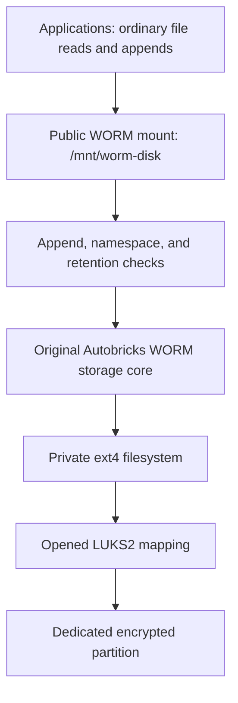
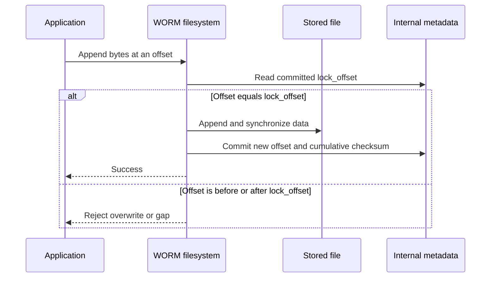

# Autobricks WORM Disk

Autobricks WORM Disk provides **appendable WORM (Write Once, Read Many) storage
on a dedicated, encrypted disk partition**. Applications can keep adding records
to a file while every previously committed byte remains protected from overwrite
through the WORM mount.

It is based on [Autobricks WORM](https://github.com/pregene/autobricks-worm),
reusing its appendable WORM core, retention rules, incremental SHA-256 checksums,
and storage transaction recovery. This product adds a dedicated disk source,
LUKS2 encryption during installation, and service-managed mounting and closure.
The original project's [README](https://github.com/pregene/autobricks-worm/blob/main/README.md)
explains the underlying appendable WORM model.

The command is `ab-worm-disk`, the service is `ab-worm-disk.service`, and the
Debian package is `autobricks-worm-disk`. See [VERSION](VERSION) for the product
version. This product supports **Linux only**.

## How this differs from Autobricks WORM

Choose [Autobricks WORM](https://github.com/pregene/autobricks-worm) when the
storage source is an existing directory. Choose **Autobricks WORM Disk** when a
dedicated disk partition should be initialized, encrypted, and managed as a
WORM volume by the installer and service.

The difference is the managed storage volume. Applications still use ordinary
files through FUSE, but the disk product owns the setup and lifecycle of the
selected partition, its LUKS mapping, and its private backing filesystem.

| Area | Autobricks WORM | Autobricks WORM Disk |
| --- | --- | --- |
| Storage source | A backing directory | A dedicated partition, with a private ext4 filesystem behind the WORM mount |
| Append and retention policy | Committed-prefix protection and expiry-based deletion | The same WORM core and policy |
| Encryption setup | Not supplied by the backing-directory interface | New installations require LUKS2 and generate a protected disk-unlock credential |
| Metadata access | Read-only sibling `.meta` entries | Hidden internal metadata, with a read-only `checksum FILEPATH` command |
| Installation | Directory-backed service setup | Partition selection, mount settings, retention, and required encryption |
| Service shutdown | Unmount the WORM interface | Unmount WORM, unmount the private filesystem, then close the LUKS mapping |

### A dedicated encrypted volume

The installer selects an unused, writable partition rather than asking for a
backing directory. After explicit confirmation, it initializes that partition
with LUKS2 and creates the ext4 filesystem inside the encrypted volume. LUKS
is required for new installations and cannot be unchecked. This works with
suitable HDD, SSD, or USB partitions; it is not limited to USB storage.

The encrypted partition can contain an ongoing recording while applications
see only the WORM mount. When the mapping is closed, reading the medium requires
a valid unlock credential. This adds protection for a removed or separately
accessed disk that the original backing-directory interface does not itself
provide. It does not protect against an administrator who has the locally
stored credential or access to the open mapping.

### One service manages the storage layers

Starting the service opens LUKS, mounts ext4 privately, and exposes the WORM
interface at the configured public mount point. Stopping it reverses that order:
public WORM mount, private ext4 mount, then LUKS mapping. Cleanup errors remain
errors; a stopped service is not by itself proof that encrypted access is closed.
Applications do not need to open LUKS or mount the backing filesystem themselves.

### File metadata without exposing internal files

The original project exposes read-only sibling `.meta` entries. The disk product
hides those entries from listings and direct access. Applications instead use
`ab-worm-disk checksum FILEPATH` to read the committed position, checksum, and
retention fields through the mounted file. This keeps the normal file namespace
free of internal metadata while retaining the checkpoint information needed
for integrity checks.

The source is a block device, not a user-selected folder. A mount point such as
`/mnt/worm-disk` remains a directory through which applications access files.
The private ext4 filesystem supplies storage to the original WORM core; ext4
itself does not enforce WORM restrictions.



## Why appendable WORM?

Audit logs, event streams, and sequential recordings need to keep growing
without allowing earlier records to be edited. Autobricks WORM Disk combines
these properties in a normal mounted filesystem: create a file, append new
records, and read its committed history using familiar file operations.

The file does not have to be closed or finalized before its committed contents
are protected. If records A and B are already committed to `audit.log`, the
application can append C to that same file. It cannot replace A or B, truncate
the file, or delete it before its retention deadline through the mount.

This allows a continuous recording to stay in one growing file, instead of
requiring a separate immutable file for every event. Applications can save
position/checksum pairs as they record, then verify those earlier recording
points even after the file has grown.

| Capability | Practical benefit |
| --- | --- |
| Protect committed bytes while accepting new appends | Keep collecting records without reopening earlier contents for editing. |
| Keep successive records in one file | Avoid managing an individual immutable file for every small event. |
| Use ordinary filesystem paths | Integrate applications that already support sequential reads and append writes. |
| Report a committed position and cumulative SHA-256 checksum | Capture intermediate checkpoints for later integrity verification. |
| Continue hashing from saved incremental state | Update the checksum without rereading the entire existing file on every append. |
| Stream data through the original storage core | Read and append large files without loading the entire stored file into memory. |
| Keep the retention deadline fixed at creation | Later appends do not silently change the file's deletion eligibility. |
| Use a dedicated LUKS2-encrypted partition | Protect data at rest when the mapping is closed and no valid unlock credential is available. |

Mutable databases and applications that overwrite, truncate, or rename files
need separate mutable storage. Appendable WORM is suited to sequential records;
it does not make every application compatible with append-only access.

## How an append protects existing records

Each file has a committed end position, `lock_offset`. A write must begin
exactly at that position. An earlier offset would overwrite committed data;
a later offset would leave a gap. Both are rejected.



The reused storage core records transactions and performs recovery when storage
is reopened after an interrupted operation. This is separate from ext4's own
filesystem journal. It does not replace backups or guarantee recovery from
physical media failure.

## Recording checkpoints and detecting changes

A checkpoint pairs a byte position with the SHA-256 checksum of **all bytes
from the start of the file up to that position**. It is not merely the checksum
of the latest appended record.

For example, with three application records of 1,024 bytes each:

| Recording point | Saved `lock_offset` | Checksum covers |
| --- | --- | --- |
| After A | 1,024 | A: bytes `[0, 1024)` |
| After B | 2,048 | A + B: bytes `[0, 2048)` |
| After C | 3,072 | A + B + C: bytes `[0, 3072)` |

Record sizes and boundaries belong to the application. WORM tracks byte offsets
and does not require fixed-size records.

Read the current committed checkpoint through the mounted file:

```sh
ab-worm-disk checksum /mnt/worm-disk/example/events.log
```

The command returns JSON with `format_version`, `created_at`, `retain_until`,
`lock_offset`, and `checksum`. The offset and checksum come from one metadata
snapshot. It reports stored metadata; it does not rehash the file. Internal
`.meta` files and hash checkpoint state are not exposed through the mount.
Ordinary users can query readable files when the mount's access settings permit
it, without receiving the raw-device permissions or LUKS password.

To verify a saved checkpoint at position `N`, read exactly the first `N` bytes,
calculate their SHA-256, and compare it with the checksum saved for `N`. Later
appends beyond `N` do not change that comparison. A mismatch, or a file shorter
than `N`, means that checkpoint is not satisfied.

Applications must capture and retain intermediate checkpoints themselves,
coordinating writes and metadata reads to identify the intended boundary.
Historical checkpoints are not automatically archived. Keep trusted checkpoint
copies in independently protected storage: an attacker who can modify both the
backing data and its only checksum reference can replace both. SHA-256 metadata
is not a digital signature, and ordinary reads do not automatically verify the
entire recorded history.

## Retention and file operations

Retention applies to the **whole file from its creation time**, not separately
to each record. Appending changes the committed offset and checksum but does
not extend the retention deadline. A record appended near that deadline has
less remaining protection against whole-file deletion.

| Operation through the WORM mount | Behavior |
| --- | --- |
| Create a new file | Fix its creation time and retention deadline |
| Append at the committed end | Accept and update the committed checkpoint |
| Read a file | Return committed contents |
| Overwrite, truncate, or write beyond the committed end | Reject |
| Rename or move an entry | Reject |
| Delete a file before its deadline | Reject |
| Delete a file after its deadline | Allow under the retention policy |
| Access or modify internal metadata files | Hide and reject direct access |

Expiration permits whole-file deletion; it does not permit overwriting earlier
bytes. Applications needing a minimum retention interval for every record must
create new files on an appropriate schedule. Create each file under its final
name because rename-based log rotation is not supported.

The current Linux core uses `CLOCK_BOOTTIME`, a monotonic clock that includes
suspend time and is unaffected by wall-clock adjustments during a boot. Its
stored timestamps are not calendar timestamps. This clock resets on reboot;
the current behavior must not be treated as a persistent calendar-based
retention guarantee across reboots.

## Encryption and access boundaries

New installations always enable LUKS2; the checkbox cannot be unchecked. The
installer generates an unlock password and stores it in the root-protected
configuration. Keep a protected backup of that configuration if existing
encrypted data must remain recoverable. TPM 2.0 is not available in version 1.1.

The service opens the encrypted volume and exposes the public WORM mount.
During shutdown it unmounts the public interface and private filesystem before
closing the mapping, and checks for cleanup failures. Closing the mapping
removes live decrypted access; it does not require encrypting the whole disk
again.

WORM restrictions apply to every caller using the FUSE mount, including root.
They do not prevent a privileged administrator from modifying backing storage
or an open raw mapping directly. The host's root administrator can also read
the locally stored unlock credential. LUKS protects a closed volume from access
without a valid credential or encryption key; it is not independent protection
against the administrator of the running host.

Use the public mount for all protected file operations. Do not expose the
private filesystem as an alternative application path. If shutdown fails,
inspect the service journal before restarting; a failed or stopped process alone
does not prove that the LUKS mapping has closed.

## Installation and everyday use

Ubuntu package targets are **22.04 and 24.04**, each for **amd64 and arm64**.
See the [Releases page](https://github.com/pregene/autobricks-worm-disk/releases)
for published downloads and [INSTALL.md](INSTALL.md) for installation details.
### Required system packages

LUKS support is provided by **cryptsetup**, the userspace tools used to create,
open, and close the encrypted volume. Install it on Ubuntu with:

```sh
sudo apt update
sudo apt install cryptsetup
```

The WORM mount also requires **fuse3** and kernel FUSE support (`/dev/fuse`).
**e2fsprogs** provides the ext4 formatting tools. Python 3, util-linux, systemd,
and udev support the installer, device checks, service lifecycle, and device
discovery. To install these prerequisites explicitly:

```sh
sudo apt install cryptsetup fuse3 e2fsprogs python3 util-linux systemd udev
```

The Debian package declares these dependencies. Installing the local package
with APT resolves missing dependencies automatically; `dpkg -i` alone does not.

### Install and select the partition

Install a package matching your distribution and architecture:

```sh
sudo apt install ./autobricks-worm-disk-<version>-ubuntu-<os-version>-<arch>.deb
```

The installer lists writable, unused dedicated partitions. It excludes system
disks, mounted partitions, and partitions with active holders. Existing LUKS
partitions may be selected regardless of which application created them.
**Confirming initialization erases the selected partition's existing data.**
No manual signature removal is needed. If a desktop automatically mounts the
partition, unmount it and refresh the selection screen with **R**.

The default public mount is `/mnt/worm-disk`. Keep **Allow other users** enabled
for ordinary-user access to the service mount; filesystem permissions and WORM
restrictions still apply.

After installation, using a new filename:

```sh
mkdir /mnt/worm-disk/example
printf 'first record\n' > /mnt/worm-disk/example/events.log
printf 'next record\n' >> /mnt/worm-disk/example/events.log
cat /mnt/worm-disk/example/events.log
ab-worm-disk checksum /mnt/worm-disk/example/events.log
```

Use `>>` for later appends. Repeating `>` on an existing file attempts truncation
and is rejected. See [HOWTO.md](HOWTO.md) for file operations and metadata fields.

```sh
ab-worm-disk --help
ab-worm-disk --version
sudo systemctl status ab-worm-disk.service
sudo systemctl stop ab-worm-disk.service
sudo systemctl start ab-worm-disk.service
```

Installing over an existing configuration preserves settings and credentials
without reinitializing the partition. Removal preserves configuration; purge
requires separate confirmation before deleting disk-access information. Neither
operation formats the disk. A fresh installation after purge can initialize the
selected partition after explicit confirmation. To reuse its existing encrypted
data instead, retain a valid unlock credential and restore the configuration;
leaving encrypted bytes on disk alone is not sufficient for recovery.

## Project relationship and licenses

[Autobricks WORM](https://github.com/pregene/autobricks-worm) is the original
appendable WORM filesystem project. Autobricks WORM Disk applies that core to
dedicated disk storage with integrated encryption and service lifecycle
management. The two products have separate executable, service, and package
names.

This repository publishes documentation and installation packages; application
source is not published here. Use and redistribution are governed by the
[Autobricks Source-Available License 1.0](LICENSE). The license permits original
unmodified builds and their inclusion in commercial products, with required
notices. Modifying source or building, using, or distributing modified versions
requires the licensor's written authorization.

See [Third-party notices](THIRD_PARTY_NOTICES.md) and
[Filesystem dependency licenses](docs/DEPENDENCY_LICENSES.md) for dependency
licenses and attribution. Historical notices for excluded platforms do not
indicate macOS or Windows support in this product.
