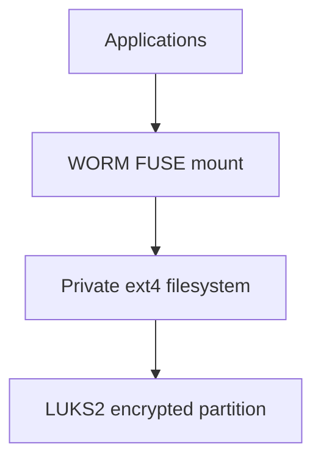

# autobricks-worm-disk

Linux-only disk-backed WORM storage, based on `autobricks-worm`.

The product uses a dedicated disk partition as its storage source and exposes
files through a Linux FUSE mount. macOS and Windows are not supported.

Version **1.1** requires LUKS encryption for new installations. TPM 2.0 is not
available; its installer control is disabled.

The installer's device list shows only available, unmounted, writable disk
partitions. Mounted partitions and system disks are excluded. To use
Autobricks WORM Disk, prepare a dedicated partition and unmount it before
selecting it in the installer. If your desktop automatically mounts the selected
partition, unmount that partition first, then press **R** in the
installer to refresh the list. The installer does not unmount devices for you.

`cryptsetup` is required to initialize LUKS encryption and open or close the
encrypted disk mapping. Install it on Ubuntu before formatting or mounting:

```sh
sudo apt install cryptsetup
```

Mounting also requires Linux FUSE support (`/dev/fuse`) and a FUSE unmount helper
such as `fusermount3`. The disk filesystem uses ext4 (`e2fsprogs`).
Applications access protected files through the public FUSE mount.

LUKS alone does not prevent access by the host's root administrator. When a
LUKS password or key is stored in a configuration file, root can read it and use
it to unlock the disk. Root can also access an already opened decrypted block
mapping. This administrative access is within the security boundary of a
LUKS-only configuration; LUKS does not enforce the WORM policy on direct block
access. WORM restrictions still apply to root when accessing files through the
product's FUSE mount. Root privileges alone do not unlock a closed LUKS volume
without a valid unlock credential or access to its encryption key. See the
[cryptsetup FAQ](https://gitlab.com/cryptsetup/cryptsetup/-/blob/main/FAQ.md).



Disk storage requires a dedicated partition initialized with
`ab-worm-disk format DEVICE`. Initialization erases the selected partition.
Mounting requires an existing empty mount directory, normally `/mnt/worm-disk`.
Directories and ordinary files are not accepted as storage devices.

Files support creation, append, read, and deletion after their retention deadline.
Committed data cannot be overwritten or truncated. Integrity and retention
metadata are not exposed as `.meta` files, including through `ls -a` or direct
file access.

Read a mounted file's stored checksum and retention metadata without sudo:

```sh
ab-worm-disk checksum /mnt/worm-disk/example.log
```

The command returns JSON through the mount's read-only metadata interface.
Keep **Allow other users** enabled for access by ordinary users to a service
mount. See [HOWTO.md](HOWTO.md) for the output fields and access rules.

Source code may be inspected and referenced for independent development without
copying protected implementation code. The license permits building original source without modifications, and include the resulting binaries or libraries
in your own products for commercial use, sale, and redistribution. Preserve this
license and applicable notices with the included component. Official Autobricks
packages may also be used and redistributed. Modifying the source or building,
using, distributing, or incorporating modified versions requires prior written
permission under [LICENSE](LICENSE).

This repository distributes documentation and installation packages; application
source is not published here. Download packages from the
[Releases page](https://github.com/pregene/autobricks-worm-disk/releases).
For installation and service management, see [INSTALL.md](INSTALL.md).

Project source is licensed under the [Autobricks Source-Available License 1.0](LICENSE).
[Third-party notices](THIRD_PARTY_NOTICES.md) and the dependency license review are
preserved from upstream, including historical references to excluded platforms.
